# Lets get started with the First Hands-On Session

## Tasks

### Task 1
1. Create your own Namespace (like your own project)

    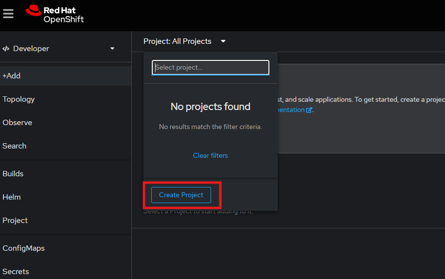

2. Create the frontend Deployment by importing the yaml template
	1. Go to the [Github Repository](https://github.com/anairo98/openshift-training/tree/main) and navigate over the **e-commerce** folder to the **frontend** folder and then to the **deployment.yml** 
	2. Copy the content of the **deployment.yml** 
	3. Switch to the Openshift Console and paste the content into the *Import Yaml* field
		
        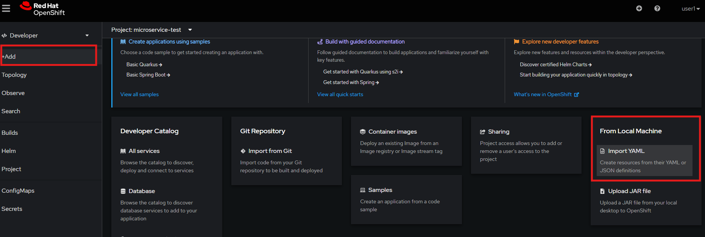

	4. Click on **Create** and you will create the *frontend* deployment
    5. Go to **Topology** in Openshift Console and check on your newly created Pod

        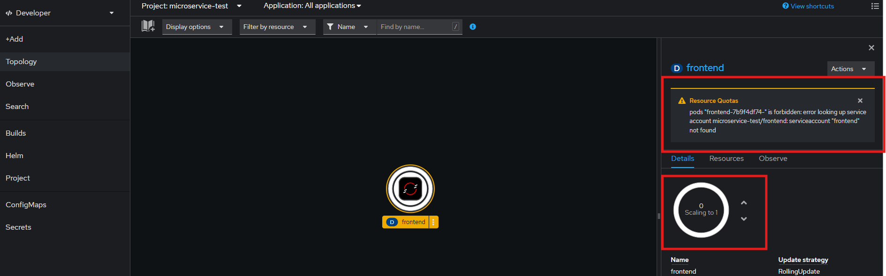

3. There is some problem with your Pod, it is not running! Find out what the problem is about!?

    !!! note "Do you need help?"
        If you cannot solve the problem, switch to the **Solutions for Troubleshooting** chapter on this website (scroll down :winking_face:) 

4. When you fixed the Problem, you maybe need to scale down and after that scale up your Pod again (so the changes are getting activated):

    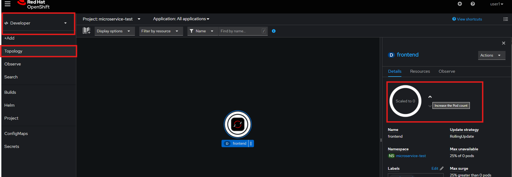

5. Give it a moment and wait until the Pod is running!

    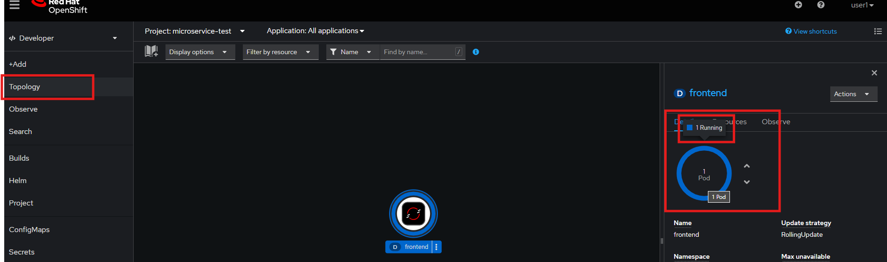

---

### Task 2
1. Create a Service, which abstracts the *frontend* Deployment
2. Go to the **Administrator** view and search for **services** under the **Networking** section

    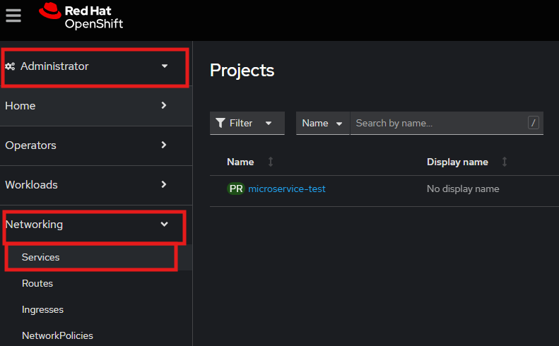

3. Click on **Create Service** button
4. Enter all necessary information

    !!! tip
        If you are unsure how to enter it, have a look at the following Yaml file: 

    ```yaml
    apiVersion: v1
    kind: Service
    metadata:
      name: frontend
      labels:
        app: frontend
    spec:
      type: ClusterIP
      selector:
        app: frontend
      ports:
      - name: http
        port: 80
        targetPort: 8080
    ```

5. Verify if the Service is linked to the prior created *frontend* Pod 
	1. Click on the *frontend* Service
	2. Click on the *Pods* section:

        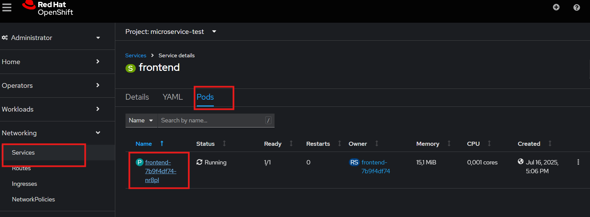

	3. You can also verify by going back to the **Topology** section and click on the *frontend* Pod. There is now under the **Resources** section also the *frontend* Service linked

        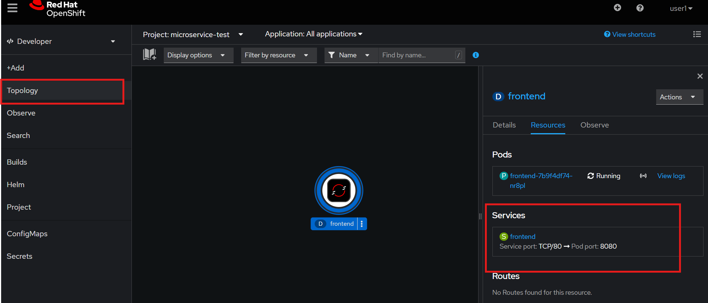

---

### Task 3 
Create a Route by using the OpenShift UI  (not by using the manifest files given in the Github)

1. Go to **Administrator** view and click on **Routes** under the **Networking** section and click on the **Create Route** button

    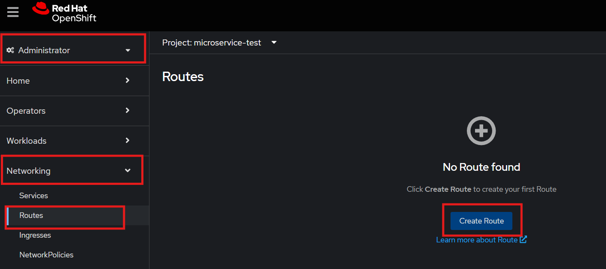

2. Give the Route a name: *frontend*
3. Select the correct *frontend* Service, which we created in **Task 2**
4. Select the correct *Port* (Service Port) :right_arrow: *TargetPort* (Port on the Container)

    !!! note
        Only fill out the fields which are necessary (marked with a red asterisk)

5. Click on **Create** to create the service 

    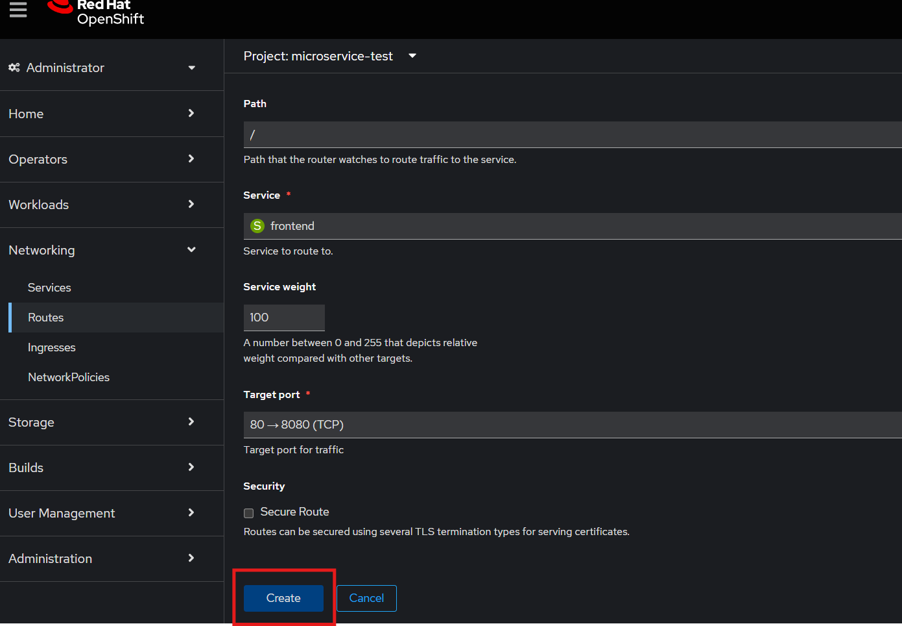

6. Give it a second :stopwatch:
7. verify the Route: Go back to the **Topology** and click on the Route sign on the right hand side of the Pod 

    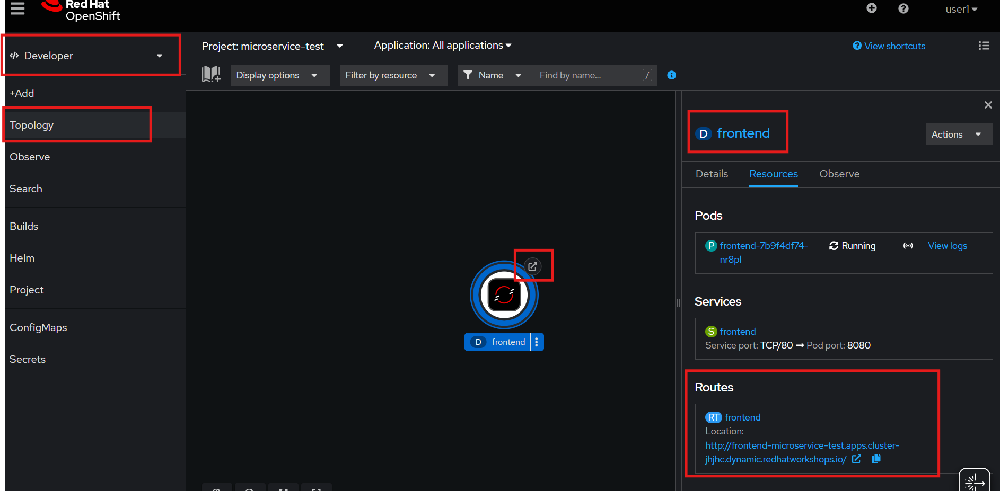


!!! info
    You will see that the frontend is loading but you get an *500 Internal Server Error* if you open the website. The *Internal Server Error* occurs, because you only have the frontend deployed and all of the backend is still missing. 
    So don't worry, we will do this together step by step :smiling_face_with_halo:

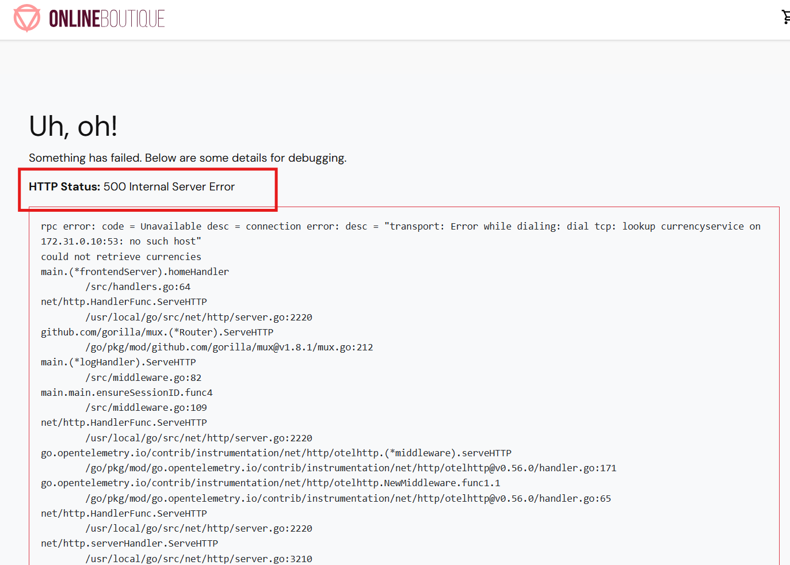


*** 

## Solutions for Troubleshooting

### Solution of Task 1

Frontend Pod was not created, but why?!

1. Check the Error message

    

2. Go to the **Deployments** (*Hint*: you can find it, if you switch to the **Administrator** and under **Workloads**)
3. Check the **ReplicaSet** of the *frontend* Deployment 

    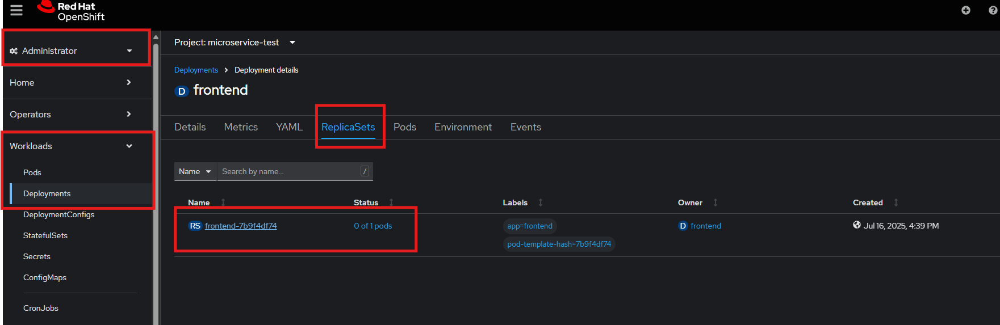

4. Check the **Events** of the *Replicaset*

    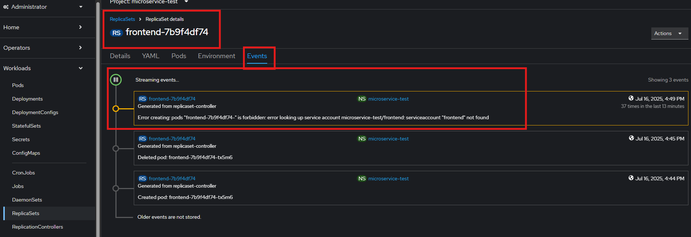

5. You got it! You are missing the expected *Service Account*
6. Create the missing *frontend* Service Account

    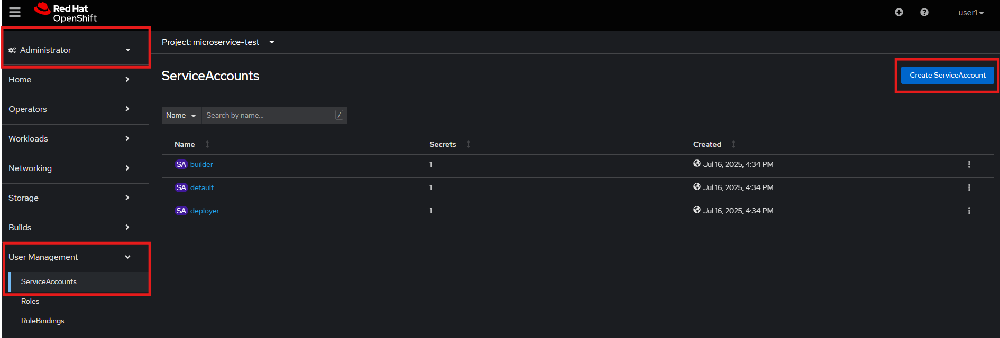

!!! info
    As you can see there are already three Service Accounts. These serviceaccounts are the default Service Accounts. But for our created *frontend* deployment we do not want to use one of the default once. 

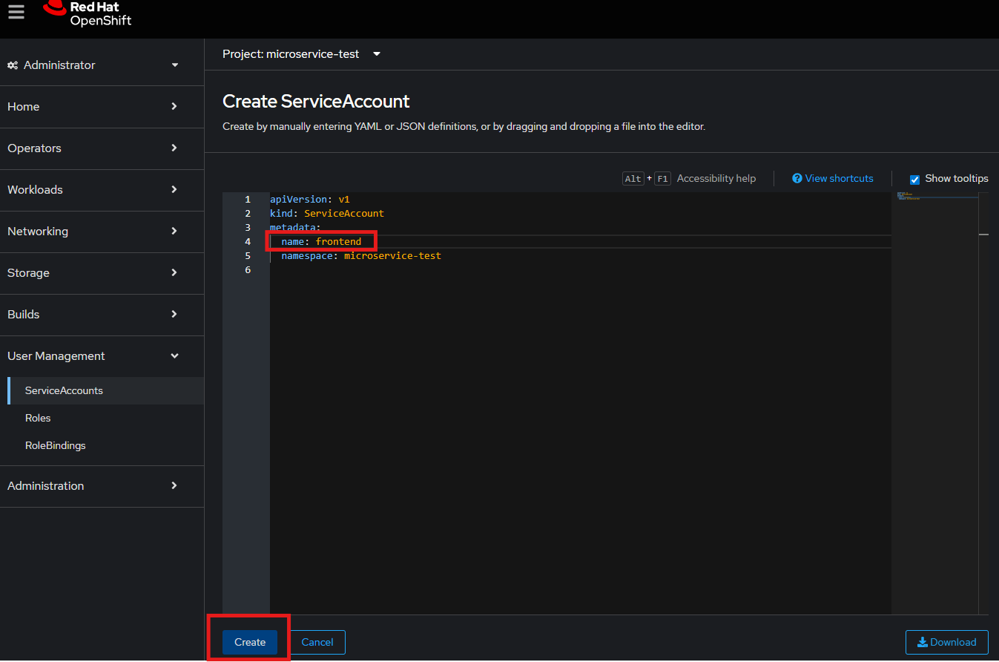

!!! hint
    It is important that you name the Service Account exactly as mentioned in you Deployment.yml file