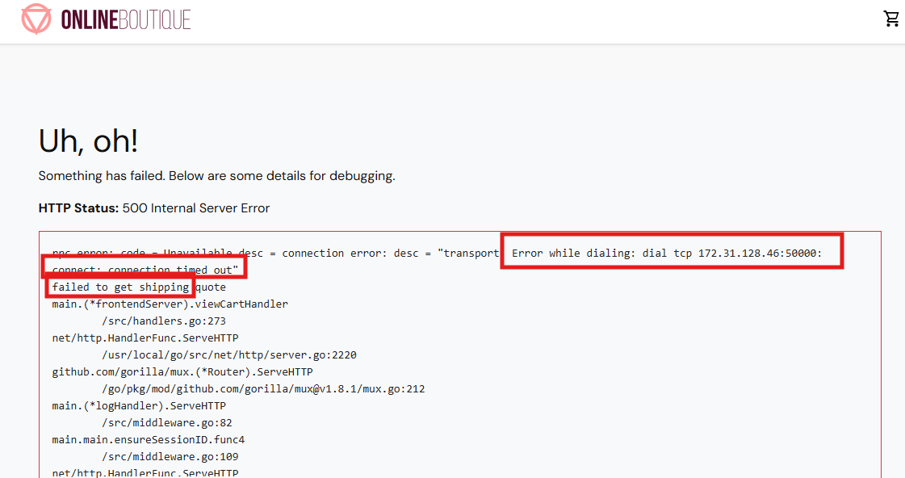
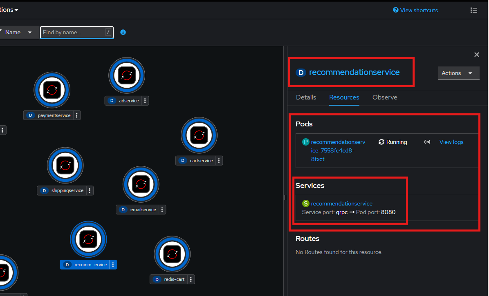

# Second Hands-On Lab

## Tasks

### Task 1: Troubleshooting

1. Deploy the Loadgenerator Microservice from the **manifest.yml** file 
2. Click on the Pod and check if it is running

    

3. Check out the Containers inside of the Pod (Init-Containers and the main one)

    

4. Click on the Init-Container **frontend-check** and read *command* section and also the fail message

    !!! failure
        Seems like the init-container has a problem!

    

5. Navigate back to the Pod and click on the **Events** of the Pod 

    !!! info
        *failed container frontend-check* message. The problem lays in the init-container for sure.

     

6. Open the logs of the **frontend-check** pod and NOT of the main container

    

7. Download the logs to have better insights. Click on **raw** or on **download** 

    

    !!! tip 
        If the Init-Container cannot finish, the main container cannot start! Try to solve it by yourself! If you are not able to solve it by yourself, have a look at the *solution* section.

    !!! success
        Perfect! You troubleshooted successfully! 

8. Check out the logs again of the **loadgenerator** pod. You should see all of the API-Requests, which the loadgenerator is sending (since the **productservicecatalog** is created now)

9. Have a look at the **boutique webshop**, it should look like this:

    

10. Download again the logs of the **frontend** pod and check it out 

    !!! hint
        Newest logs can be found at the bottom. Thereby, you have to scroll down for the latest ones. 

        !!! info
            You are maybe still seeing some errors, but none of them are regarding to the missing **productservicecatalog**. They are regarding due to some more services, which are missing. So do not worry about that for now. 


### Task 2: Using the CLI

1. Open the Web Terminal in your OpenShift Namespace. Choose the project in which you would like to open the Web Terminal and click on *Start*

    

2. Clone the Public GitHub Repository, so you can use the *manifest.yml* files inside of the cluster 
    1. Switch to the Github Repository and copy the https link to the clipboard 

        

    2. Switch back to the OpenShift UI and enter the CLI 

    3. Use the following command to clone the public repository

    
    ```bash
    git clone <https://GITHUB-LINK>
    ```

3. Ensure that the repository was successfully cloned (using *Linux-Commands*)
4. Enter the **e-commerce** folder in your CLI
5. Prior to creating the **emailservice**, verify that you are on the right namespace and logged in as the correct user. Use the oc-CLI-Tools 

    ```bash
    oc project 

    oc projects 
    ```

6. Create the **emailservice** by using the **manifest.yml** (stored inside of the emailservice folder) 

    ```bash
    oc apply –f manifest.yml
    ```

    

7. Verify that the deployment, service and serviceaccount have been created successfully (via CLI)

    ```bash
    # Check the Deployments:
    oc get deployment

    # Check the Services:
    oc get service 

    # Check the Serviceaccounts:
    oc get serviceaccount
    ```

    

8. Now create the **paymentservice** microservice

    !!! note
        In this case, there is not an manifest.yml for the **paymentservice** but we need to create the microservice step-by-step.

    1. Create a **serviceaccount**, which is named **paymentservice** via CLI 

        

    2. Ensure that the **serviceaccount** with the correct name was successfully created

    3. Create the **paymentservice** deployment like we did before with the **emailservice**

    4. Verify the **paymentservice** deployment is running 

    5. Now create the **paymentservice** service on the CLI using an imperative way. Use the following commands

            ```bash
            oc create service clusterip paymentservice --tcp=50051:50051
            ```
    6. The Service still needs to be connected to the Deployment and we would like to name the service endpoint

            ```bash
            oc edit service paymentservice
            ```

            ```yaml
            apiVersion: v1
            kind: Service
            metadata:
            name: paymentservice
            labels:
                app: paymentservice
            spec:
            type: ClusterIP             
            selector:
                app: paymentservice
            ports:
            - name: grpc
                port: 50051
                targetPort: 50051
            ```

        !!! note
            Add the missing parts. 

9. Exit the Command Line and use the OpenShift UI to verify in the Topology that everything was created succesfully! It should look like this: 

    


### Task 3: Troubleshooting 

1. Deploy the **shippingservice** by using the **manifest.yml** 
2. Check out the Boutique webapp and ensure the service is successfully bound to the applications frontend
    1. Enter the *shopping cart* (the frontend needs the *shippingservice* as well as the *cartservice* to show the *shopping cart* informations)

        

        !!! failure
            Seems like the **frontend** service cannot build up a connection to the **shipping** service

3. Find out about the problem and troubleshoot! 

    !!! hint
        If you really cannot find the solution by your own, you can have a look at the solution section. But first please try it out!

    !!! success
        After you fixed the problem, you can validate that it works: 

4. Navigate to the topology and check out your changes

    1. Click on the route and then in the *Boutique Shop* on the *Shoppingcart* symbol
    2. The **frontend** should be able to connect to the **shipping** service. 
    3. It should look like this: 

        

    !!! hint
        Maybe it is neccessary to empty the cache of your browser!


### Task 4: Troubleshooting 

1. Create the **recommendationservice** Deployment
2. Create the **recommendation** Service
3. Ensure the Deployment and the Service are connected together 

    

    !!! danger "Failure"
        Does it look like on the screenshot? No?! Then there is probably something wrong.

4. Troubleshoot!


## Solutions

### Solution Task 1

!!! hint
    There seem to be some problems with the frontend app, as the **loadgenerator** pod cannot reach it

1. Check out the logs of the frontend pod in the same way 
2. Inside of the logs, search for the keyword *error* to check whats wrong

    

    !!! failure
        There is an error because the **frontend** cannot reach the host called **productcatalogservice** 

3. Create the **productcatalogservice** microservice (you can find the *manifest.yml* in the Github Repository)
4. After you did that, ensure the **loadgenerator** pod is running again. Check if the **init-container** finished and if the **main** container is running 

    

    !!! success
        If everything is running you are doing fine and you can go back to the task 1


### Solution Task 3

1. The error message says that the **frontend** could not establish a connection to **172.31.128.46:50000**
2. Check if the IP and the Port is the correct one of the **shipping** service
3. Navigate to the service of the **shipping** deployment, because the service provides an static endpoint for the **shipping** deployment

    !!! Warning 
        Seems like the IP-addresse is the right one, but the Port of the Service is not 50000, but 50051! Here is a Port mismatch!

4. Fix This!
5. Navigate to the **frontend** deployment and check out the environment variables, which are set for the **frontend** deployment

    

    1. The port is wrong
    2. Correct the port and click on *save* 

    !!! tip 
        Wait a bit... The old pod of the **frontend** gets deleted and a new pod with the updated configs and environment variables comes up

    
### Solutions Task 4

!!! info
    Deployments and Services are connected to each other by using labels 

1. Check the label, which is assigned to the **recommendation** deployment
2. Compare this label with the used selector in the **recommendation** service 
3. Correct the selector in the **recommendation** service to match the label
4. Now, ensure again if the Deployment is bound to the Service


