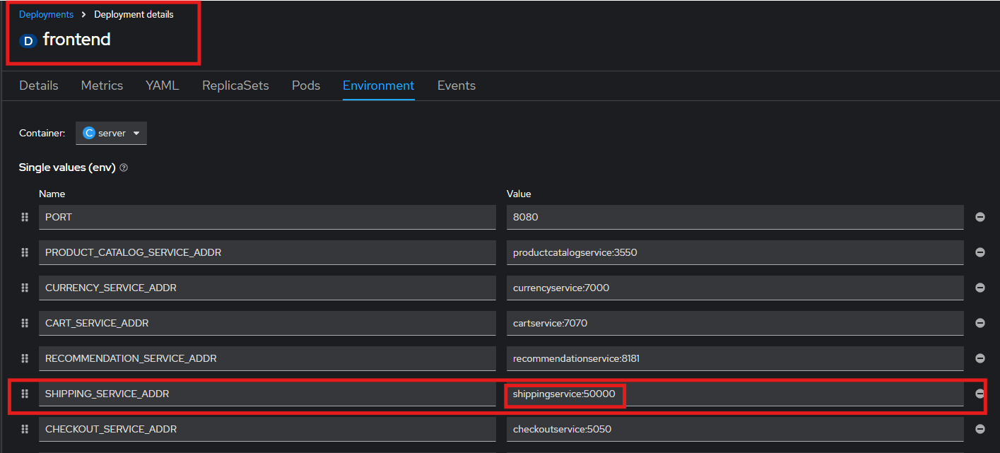

# Second Hands-On Lab

## Tasks

### Task 0: Recap 

Please recreate the environment from session 2

!!! tip
    You can use the manifest.yml under the *quickstart-into-session3* folder of the GitHub Repository

To recap your knowledge until now. You should be able to answer the following questions: 

1. What is the main purpose of a Deployment?
    1. To expose services to the internet
    2. To manage the lifecycle of Pods and ensure desired state
    3. To store secrets and configuration data
    4. To monitor cluster health

2. What does a ServiceAccount provide in Kubernetes?
    1. A way to expose services externally
    2. A method for authenticating users via OAuth
    3. An identity for processes running in Pods to interact with the API
    4. A configuration for persistent storage

3. What is the role of a ReplicaSet?
    1. To manage the number of running Pods
    2. To route traffic between services
    3. To store container images
    4. To define access control policies

4. What is an Operator in OpenShift?
    1. A built-in monitoring tool for Pods
    2. A controller that extends Kubernetes to manage applications and their components
    3. A user role with elevated permissions
    4. A network policy for routing traffic

5. What is the key difference between a Kubernetes Service and an OpenShift Route?
    1. Services handle internal traffic only, while Routes handle external traffic exclusively
    2. Services define how Pods are accessed within the cluster, while Routes provide external HTTP/HTTPS access to Services using OpenShift’s routing layer
    3. Services are used for DNS resolution, while Routes manage persistent storage
    4. Services and Routes both expose applications externally, but Routes are required for TCP traffic

6. On which Port does the *checkout* Pod run? 

7. What is the Label of the *adservice* Service?

### Task 1: Troubleshooting 

1. Deploy the **shippingservice** by using the **manifest.yml** 
2. Check out the Boutique webapp and ensure the service is successfully bound to the applications frontend
    1. Enter the *shopping cart* (the frontend needs the *shippingservice* as well as the *cartservice* to show the *shopping cart* informations)

        

        !!! failure
            Seems like the **frontend** service cannot build up a connection to the **shipping** service

3. Find out about the problem and troubleshoot! 

    !!! hint
        If you really cannot find the solution by your own, you can have a look at the solution section. But first please try it out!

    !!! success
        After you fixed the problem, you can validate that it works: 

4. Navigate to the topology and check out your changes

    1. Click on the route and then in the *Boutique Shop* on the *Shoppingcart* symbol
    2. The **frontend** should be able to connect to the **shipping** service. 
    3. It should look like this: 

        

    !!! hint
        Maybe it is neccessary to empty the cache of your browser!

### Task 2: Troubleshooting 

1. Create the **recommendationservice** Deployment
2. Create the **recommendation** Service
3. Ensure the Deployment and the Service are connected together 

    

    !!! danger "Failure"
        Does it look like on the screenshot? No?! Then there is probably something wrong.

4. Troubleshoot!

## Solutions

### Solution Task 1

1. The error message says that the **frontend** could not establish a connection to **172.31.128.46:50000**
2. Check if the IP and the Port is the correct one of the **shipping** service
3. Navigate to the service of the **shipping** deployment, because the service provides an static endpoint for the **shipping** deployment

    !!! Warning 
        Seems like the IP-addresse is the right one, but the Port of the Service is not 50000, but 50051! Here is a Port mismatch!

4. Fix This!
5. Navigate to the **frontend** deployment and check out the environment variables, which are set for the **frontend** deployment

    

    1. The port is wrong
    2. Correct the port and click on *save* 

    !!! tip 
        Wait a bit... The old pod of the **frontend** gets deleted and a new pod with the updated configs and environment variables comes up

    
### Solutions Task 2

!!! info
    Deployments and Services are connected to each other by using labels 

1. Check the label, which is assigned to the **recommendation** deployment
2. Compare this label with the used selector in the **recommendation** service 
3. Correct the selector in the **recommendation** service to match the label
4. Now, ensure again if the Deployment is bound to the Service