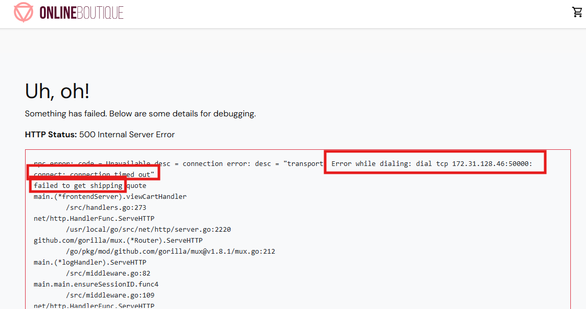
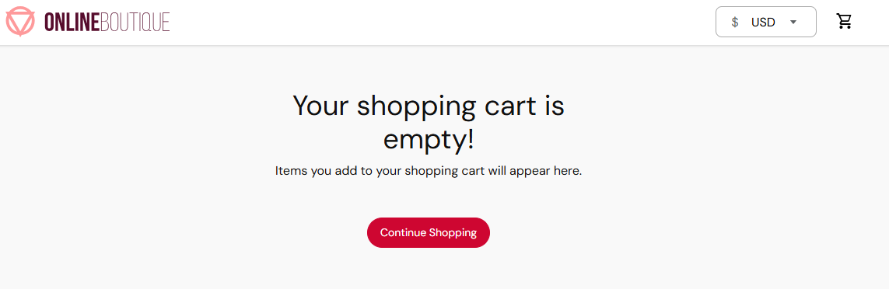
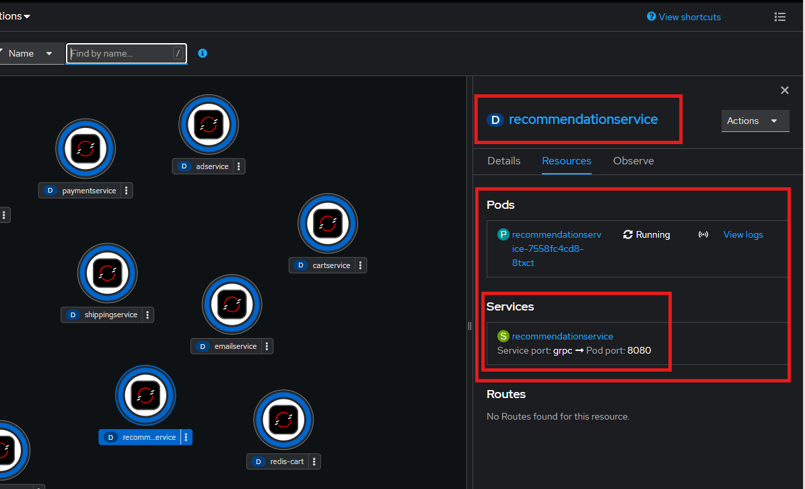

#  3. Hands-On Lab

## Tasks

### Task 0: Recap 

Please recreate the environment from session 2

!!! tip
    You can use the manifest.yml under the *quickstart-into-session3* folder of the GitHub Repository

To recap your knowledge until now. You should be able to answer the following questions: 

[Quiz Link](https://forms.office.com/Pages/ResponsePage.aspx?id=ZGZljjZfW0qVTMVAX9KSBjhzaJv-m0hJoQL2QDQKeitUNkVMR1BLNDJMR0cyNTBQMEQ5QVdFMkNWOC4u)

1. What is the main purpose of a Deployment?
    1. To expose services to the internet
    2. To manage the lifecycle of Pods and ensure desired state
    3. To store secrets and configuration data
    4. To monitor cluster health

2. What does a ServiceAccount provide in Kubernetes?
    1. A way to expose services externally
    2. A method for authenticating users via OAuth
    3. An identity for processes running in Pods to interact with the API
    4. A configuration for persistent storage

3. What is the role of a ReplicaSet?
    1. To manage the number of running Pods
    2. To route traffic between services
    3. To store container images
    4. To define access control policies

4. What is an Operator in OpenShift?
    1. A built-in monitoring tool for Pods
    2. A controller that extends Kubernetes to manage applications and their components
    3. A user role with elevated permissions
    4. A network policy for routing traffic

5. What is the key difference between a Kubernetes Service and an OpenShift Route?
    1. Services handle internal traffic only, while Routes handle external traffic exclusively
    2. Services define how Pods are accessed within the cluster, while Routes provide external HTTP/HTTPS access to Services using OpenShift’s routing layer
    3. Services are used for DNS resolution, while Routes manage persistent storage
    4. Services and Routes both expose applications externally, but Routes are required for TCP traffic

6. On which Port does the *checkout* Pod run? 

7. What is the Label of the *adservice* Service?

### Task 1: Troubleshooting 

1. Deploy the **shippingservice** by using the **manifest.yml** 
2. Check out the Boutique webapp and ensure the service is successfully bound to the applications frontend
    1. Enter the *shopping cart* (the frontend needs the *shippingservice* as well as the *cartservice* to show the *shopping cart* informations)

        

        !!! failure
            Seems like the **frontend** service cannot build up a connection to the **shipping** service

3. Find out about the problem and troubleshoot! 

    !!! success
        After you fixed the problem, you can validate that it works: 

4. Navigate to the topology and check out your changes

    1. Click on the route and then in the *Boutique Shop* on the *Shoppingcart* symbol
    2. The **frontend** should be able to connect to the **shipping** service. 
    3. It should look like this: 

        

    !!! hint
        Maybe it is neccessary to empty the cache of your browser!

### Task 2: Troubleshooting 

1. Create the **recommendationservice** Deployment
2. Create the **recommendation** Service
3. Ensure the Deployment and the Service are connected together 

    

    !!! danger "Failure"
        Does it look like on the screenshot? No?! Then there is probably something wrong.

4. Troubleshoot!
