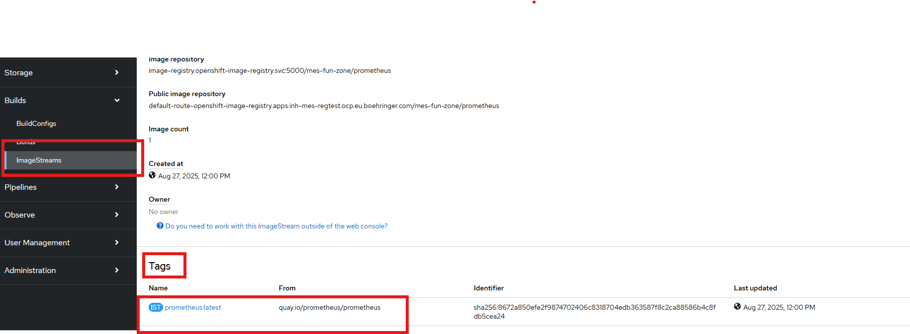

# 4. Hands-On Lab

## Tasks

### Task 0: Recap 

### Task 1: ImageStreams and Deployment

1. Create a Imagestream which should refer an nginx image from [Quay.io](https://quay.io/repository/nginx/nginx-unprivileged) 

    !!! tip
        There is a template in the GitHub in the folder: session4/nginx
2. Create a deployment based on that newly created Imagestream. 
    - The Deployment should have the following characteristics:
        - name: nginx-unprivileged 
        - port: 8080
        - label: app: nginx-unprivileged
        - image: REFERENCE-TO-IMAGESTREAM:TAG

    !!! hint
        You can create the Deployment by using the survey or by using the YAML input field. If you would like to use the YAML input, it can be helpful to reference the Kubernetes documentation: [Deployments in Kubernetes](https://kubernetes.io/docs/concepts/workloads/controllers/deployment/)

3. Create a Service names *nginx-unprivileged* of the Deployment

    !!! hint
        Keep in mind, that you are connecting the correct Deployment to yout service and to set the *targetPort* correct!

4. Create a Route of the Service to access the *nginx* Deployment from outside the cluster 

5. Verify that the Deployment, Service and Route works correctly by entering the Route. It should look like this: 

    

### Task 2: Deploy from Containerfile 

1. Create a ImageStream 
2. Create a BuildConfig by using the *session4/python_app/buildconfig.yml* file

    !!! hint
        You need to adjust some of the fields in the BuildConfig. 

3. Start a Build 
4. Verify that the Image is tagged to your created ImageStream 

    

5. Create a Deployment of the *python-app*, which uses the newly tagged image of the ImageStream 

6. Create a Service of the *python-app* Deployment

    !!! hint
        Keep in mind, that you need to set the correct *label* and *targetPort*

7. Create a Route to access the *python-app* also from outside the cluster

    !!! success
        If everything works correctly, you should see the following message. 

    

### Task 3: Setting up Prometheus and Scraping logs from the python-app

We would now like to scrape metrics from the *python-app* in a Prometheus server.

The application has already defined an endpoint **/metrics** in the container file and in the app.py file, which runs on **port 8000**.

1. Make this Endpoint of the *python-app* accessible from inside and outside the cluster (Create service and route). Depending on the names you gave, it should like similar to this:

    

2. Create a ConfigMap, which should be consumed from the Prometheus server (manifest file can be found under the **session4/prometheus/** folder in the GitHub)

    !!! info
        Contains the configurations for the endpoint from which the metrics are to be obtained (*python-app*) and, for example, the intervals at which the metrics are to be scraped

3. Create an imagestream, which refers to an **Prometheus** image from [Quay.io](https://quay.io/repository/prometheus/prometheus)

    

4. Create a Deployment which uses the *image* from the newly created **ImageStream** 
    
    !!! note
        use the **deployment.yml** template, which can be found in the session4/prometheus folder on GitHub

5. Create a Service and a Route for the *Prometheus server* to acces it:

    

6. Verify that the *Prometheus* is scraping data from the *python-app*. In the *Prometheus* UI click on *Status* and then on *Target health*: 

    
