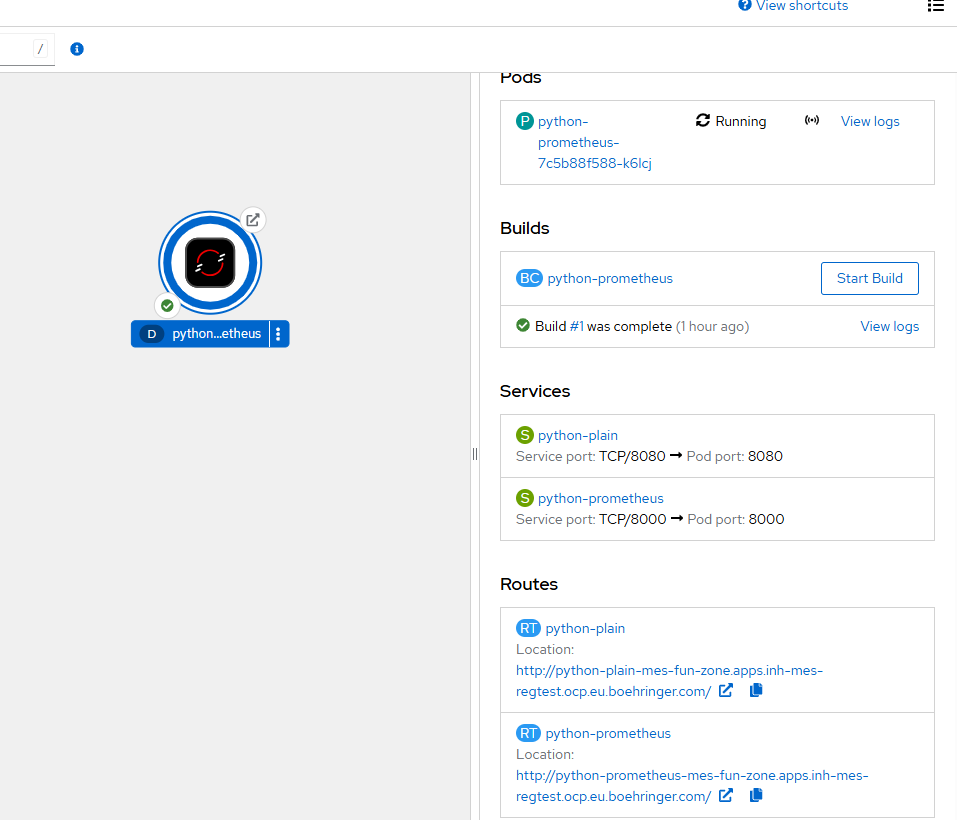
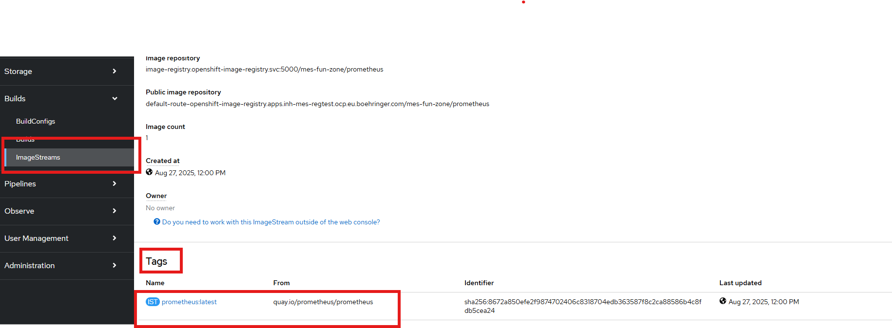
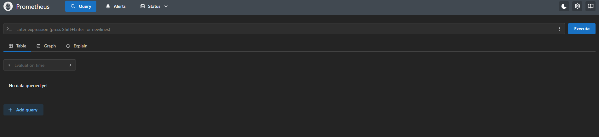
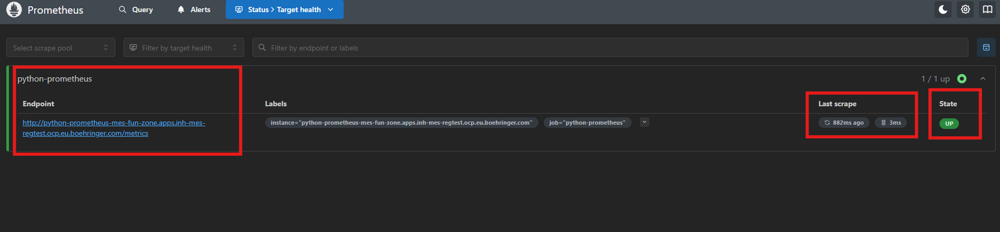
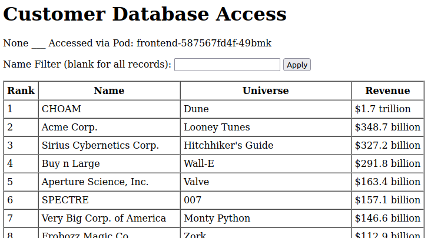

# 5. Hands-On Lab

## Tasks

### Task 0: Recap Task 

Let's start with a short recap task that revisits what we learned in session 4. 
We will start by deploying the Python application from task 2 again. You can find the corresponding manifest files in the Github folder session5_task0.

1. Deploy the first manifest file *manifest1.yml*, it contains the yaml files for the Imagestream and the BuildConfig
2. Deploy the second manifest file *manifest2.yml*, which contains the yaml file for the Deployment, Service and the Route

    !!! hint
        You need to adjust the name of the image to refence the correct *Imagestream* 

Now we would now like to scrape metrics from the *python* application in a Prometheus server.

The application has already defined an endpoint **/metrics** in the container file and in the app.py file, which runs on **port 8000**.

1. Make this Endpoint of the *python-app* accessible from inside and outside the cluster (Create service and route). Depending on the names you gave, it should like similar to this:

    !!! hint
        You already have created the Deployment, a Service and a Route, which listens on Port 8080. 
        Now you should create a Service and a Route to the same Deployment but to the endpoint on port **8000**

    

> Now we can start to deploy the Prometheus server:

2. Create a ConfigMap, which should be consumed from the Prometheus server (manifest file can be found under the **session4/prometheus/** folder in the GitHub)

    !!! info
        Contains the configurations for the endpoint from which the metrics are to be obtained (*python-app*) and, for example, the intervals at which the metrics are to be scraped

3. Create an Imagestream, which refers to an **Prometheus** image from [Quay.io](https://quay.io/repository/prometheus/prometheus)

    

    !!! hint
        You can find the manifest file in the folder in the GitHub. But you need to adjust the image name!

4. Create a Deployment which uses the *image* from the newly created **ImageStream** 
    
    !!! note
        use the **deployment.yml** template, which can be found in the session4/prometheus folder on GitHub and asjust the reference-path to the newly created ImageStream. 

    !!! warning 
        Probably, you will get an error. Read the logs of the failed pod. 
        The problem lays in the Hostname which you entered in the **ConfigMap** --> Check it out and fix the issue!

5. Create a Service and a Route for the *Prometheus server* to acces it:

    

6. Verify that the *Prometheus* is scraping data from the *python-app*. In the *Prometheus* UI click on *Status* and then on *Target health*: 

    

### Task 1: Secrets and ConfigMaps

1. Create a Secret with name "wealthapp", that contains the following keys and values:

    !!! tip
        You can do this directly in the WebUI, which shows a form for creating secrets. If you need further information about secrets, refer to the [Secret documentation](https://docs.redhat.com/en/documentation/openshift_container_platform/4.17/html/nodes/working-with-pods#nodes-pods-secrets).

| Key         | Value      |
|-------------|------------|
| DB_USERNAME | wealthapp  |
| DB_PASSWORD | eatTheRich |
| DB_DATABASE | revenue    |

2. Create a ConfigMap with name "wealthapp", that contains the following keys and values:

    !!! warning
        The last two keys contain multiline data. Preserve the newlines in the ConfigMap, so that the corresponding files can be used as provided here. If you need further information about ConfigMaps, refer to the [ConfigMap documentation](https://docs.redhat.com/en/documentation/openshift_container_platform/4.17/html/building_applications/config-maps).

| Key         | Value      |
|-------------|------------|
| API\_HOST    | backend    |
| API\_PORT    | "8080"     |
| DB\_HOST     | database   |
| cgi-default-app.conf  | <Directory "/var/www/html"\>   Options +ExecCGI   DirectoryIndex /cgi-bin/app.py </Directory\> |
| cgi-default-data.conf | <Directory "/var/www/html"\>   Options +ExecCGI   DirectoryIndex /cgi-bin/data.py </Directory\> |

3. Look at your Secret and ConfigMap in the WebUI. Inspect their YAML representation and check, if the values are set how you expect it.

    !!! tip
        As some values are base64-encoded, you might need to decode the values from the Secret/ConfigMap with the command `base64 -d`.

### Task 2: Adding environment variables form Secrets/ConfigMaps to Deployments

1. Deploy the resource manifests, that are provided in the repository under `session5_task1_2`, with the 3 components "frontend", "backend" and "database".

    !!! hint
        Keep in mind, that you are using your own images with the provided BuildConfigs. Thus you need to place the correct references to your ImageStreams in the Deployment manifests. The database deployment has 2 mentions of the image, that you need to replace.
2. Check your Deployments, if they are healthy. Then check the application by opening the Route URL. Do you see any errors? Diagnose them.

    !!! hint
        You might have to wait a moment for the Builds to finish. You can check the build status and logs to verify this.

3. Provide the needed environment variables to your Deployments. You can look into the YAML resource definition or at the `Environment` tab of the Deployments. The Deployments need the follwing environment variables:

| Deployment | Environment variable                               |
|------------|----------------------------------------------------|
| frontend   | API\_HOST, API\_PORT                               |
| backend    | DB\_HOST, DB\_USERNAME, DB\_PASSWORD, DB\_DATABASE |

4. Verify, that the application now works correctly. It should look like this:

    

### Task 3: Mounting files from ConfigMaps and Secrets in Deployments

Our webapp got an update with new requirements.

1. Change the BuildConfigs for the `frontend` and `backend` components, so that the `contextDir` now points to `session5_task3/build_directories/frontend` and `session5_task3/build_directories/backend` respectively and start the builds. After the builds finished, put the new image digest (the SHA Identifier) from the ImageStream into the corresponding deployments to update the used image.

2. Trigger a new Build for the `frontend` and `backend` BuildConfigs and check, if the Deployments are still healthy. Do you see any errors?

    !!! hint
        You might have to wait a moment for the Builds to finish. You can check the build status and logs to verify this.

    !!! hint
        You can look at the events and the logs of each Pod.

3. Mount the needed file from the ConfigMap in the corresponding Deployment by editing the YAML resource definitions.

| Deployment | Key in ConfigMap      | Path to mount the file to               |
|------------|-----------------------|-----------------------------------------|
| frontend   | cgi-default-app.conf  | /etc/httpd/conf.d/cgi-default-app.conf  |
| backend    | cgi-default-data.conf | /etc/httpd/conf.d/cgi-default-data.conf |

4. Verify, that the updated application now runs as intended. Check each Deployment to be healthy and access the application via its Route.
